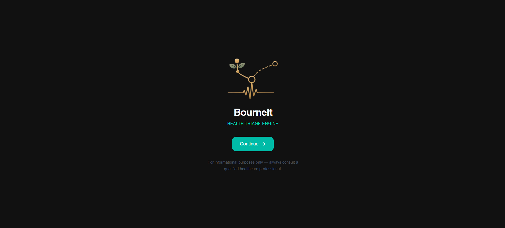
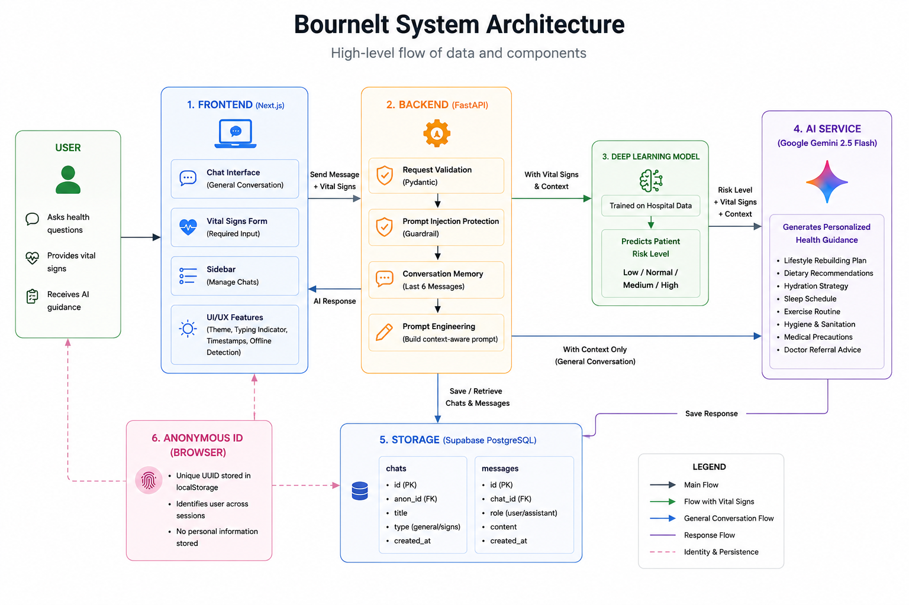

# BourneIt: Health Triage Engine

[](https://firstclinic-triage-ai-frontend.vercel.app)
[](https://jaoooooo9-firstclinic-ai-triage-engine.hf.space)

## 📸 Interface



## 📖 About

BourneIt is a full-stack intelligent health triage platform that delivers accessible medical guidance through a hybrid intelligence system. Patients input their vital signs into a structured form — a deep learning model trained on real hospital data performs clinical risk stratification (Low / Normal / Medium / High), and Google Gemini Flash 2.5 API generates personalised medical precautions and doctor-referral guidance through a natural conversation interface.


## 🧠 How It Works

| Mode | Input | Intelligence Layer | Output |
|:---|:---|:---|:---|
| **General** | Health question | Gemini LLM | Lifestyle and wellness advice |
| **Clinical** | Vital signs | Deep Learning + LLM | Risk-scored medical triage |

**User flow:**
1. Visit the site — a welcome screen appears once per browser
2. Click Continue — enter the chat directly, no login needed
3. Ask any health question, or open the Vitals panel to submit physiological readings
4. The deep learning model predicts your risk level and Gemini generates personalised guidance
5. All chats are saved automatically and reload on your next visit from the same browser


## 🏗️ System Architecture



| Category | Technology | Key Libraries / Packages |
| :--- | :--- | :--- |
| **Frontend** | Next.js 16, React 19 | `next`, `react`, `react-dom` |
| **Language** | TypeScript | `typescript`, `python`, `javascript` |
| **Styling** | Tailwind CSS v4 | `tailwindcss`, `@tailwindcss/postcss` |
| **Icons** | Lucide React | `lucide-react` |
| **Identity / Session** | Anonymous UUID (Local Storage) | Standard Web APIs (`crypto.randomUUID`) |
| **Database** | Supabase (PostgreSQL) | `@supabase/supabase-js` |
| **Backend** | FastAPI (Python) | `fastapi`, `uvicorn`, `pydantic` |
| **AI / ML** | Gemini API, Scikit-learn | `google-genai`, `joblib`, `pandas` |
| **Model Hosting** | Hugging Face | `huggingface_hub` |
| **Infrastructure** | Vercel & HF Spaces | CI/CD Automated Deployment |
| **Configuration** | Environment Secrets | `python-dotenv` |
| **Package Managers**| npm (Frontend), pip (Backend) | System dependency management |

## ✨ Features

- No login required — anonymous session tracking via browser UUID
- Persistent chat history saved to Supabase and restored on return visits
- Welcome screen shown once per browser — direct chat access on every subsequent visit
- General Consultation Mode — ask any health question freely
- Personalised Mode — submit vital signs for AI-powered risk assessment
- Deep learning model predicts Low, Normal, Medium, or High risk from physiological data
- Gemini Flash 2.5 API generates personalised precautions and doctor-referral decisions
- Dual-mode prompt engineering — risk label injected into Gemini context for clinical responses
- Conversation memory — last 6 messages passed as context so AI remembers the conversation
- Prompt injection protection via NextFirewall pattern-based guardrail
- Sidebar with separate sections for General chats and Signs (vitals) chats
- Dark and light theme toggle — preference saved across sessions
- Breathing logo animation while AI is generating a response
- Typing indicator, message timestamps, and offline detection
- Fully responsive on mobile and desktop


## 🔒 Privacy & Identity

BourneIt requires no account, email, or personal information to use.

**How identity works:**

When you visit BourneIt for the first time, a random UUID is generated in your browser and stored in `localStorage` under the key `bourneit_anon_id`. Every chat you create is saved to Supabase under this ID. When you return from the same browser, your chat history loads automatically.

**What is stored:**

| Data | Where | Purpose |
|:---|:---|:---|
| Anonymous UUID | Your browser (localStorage) | Identifies your session |
| Chat titles and messages | Supabase | Persistent chat history |
| Vital signs (submitted) | Supabase (as message content) | Part of conversation history |

**What is never stored:**

- Your name
- Your email address
- Your IP address
- Your device or location
- Any data that could identify you as an individual

**Clearing your data:**

Click **Clear all history** in the sidebar to delete all your chats from Supabase. Clearing your browser's localStorage removes your anonymous ID — the next visit creates a new one and starts fresh.

> BourneIt is for informational purposes only and is not a substitute for professional medical advice.


## 🗄️ Database Schema

Three tables in Supabase PostgreSQL. Row Level Security is enabled on all tables with permissive policies — access control is handled at the application layer via the anonymous ID.

```sql
-- Chat sessions per anonymous user
create table chats (
  id         uuid    default gen_random_uuid() primary key,
  anon_id    text    not null,
  title      text    default 'New Conversation',
  type       text    default 'general',        -- 'general' or 'signs'
  created_at timestamp default now()
);

-- Messages within each chat
create table messages (
  id         uuid    default gen_random_uuid() primary key,
  chat_id    uuid    references chats(id) on delete cascade,
  role       text    not null,                 -- 'user' or 'assistant'
  content    text    not null,
  created_at timestamp default now()
);
```

**Relationships:**
- Each `chat` belongs to one `anon_id` (anonymous browser session)
- Each `message` belongs to one `chat` via `chat_id`
- Deleting a chat cascades and removes all its messages automatically


## 🔬 Prompt Engineering

The backend constructs a structured prompt for every request — not simply forwarding the user message to Gemini:

- **Conversation history** — last 6 messages included for context memory
- **Role assignment** — Gemini instructed as a compassionate medical assistant
- **Data injection** — predicted risk level and patient vital signs embedded directly into the prompt
- **Conditional instructions** — High risk triggers immediate care advice, Medium triggers doctor referral, Low triggers lifestyle guidance

The LLM and the deep learning model work together — Gemini's response changes based on what the ML model predicts from the vital signs.

**Two prompt modes:**

| Mode | Trigger | Gemini Instruction |
|:---|:---|:---|
| Prediction-Augmented | Vitals submitted | Risk label + vitals injected, clinical guidance required |
| General Consultation | No vitals | General health education and lifestyle suggestions only |

## ⚙️ Backend Architecture

The backend is a FastAPI application on Hugging Face Spaces implementing dual-mode behaviour based on whether vital signs are provided.

### Model Loading
The deep learning pipeline is stored as a `.joblib` artifact on Hugging Face Hub and downloaded at server startup — bypassing GitHub file size limits. The bundle contains the scikit-learn pipeline, label encoder, and feature schema.

### Request Validation
Pydantic enforces strict data typing on all incoming payloads — user message, optional vital signs dictionary, and conversation history — rejecting malformed inputs at the gateway layer before any inference runs.

### Risk Prediction
Patient vitals are mapped into a Pandas DataFrame aligned to the model's feature schema and passed through the scikit-learn pipeline. The prediction is decoded to a human-readable risk label — the deterministic ML layer separating objective clinical evaluation from LLM text generation.

### Error Handling
All Gemini API calls are wrapped in targeted exception handling — rate limits return a graceful retry message, network failures return a clean fallback, masking infrastructure errors from the user entirely.

### Prompt Injection Detection
All incoming messages are screened against an adversarial pattern bank before reaching the inference pipeline. Flagged messages are immediately blocked and return a safety violation response to the frontend. This pattern-matching layer serves as the rule-based component of the NextFirewall research architecture — the full tri-modal ensemble (TF-IDF + BERT + adversarial flags, 97.3% accuracy) is planned for production integration following journal publication.


## 📁 Project Structure

```
BourneIt/
├── chatbot-frontend/
│   ├── app/
│   │   ├── chat/
│   │   │   └── page.tsx                  ← Welcome screen + main chat interface
│   │   ├── layout.tsx                    ← Root layout
│   │   ├── page.tsx                      ← Redirects to /chat
│   │   └── globals.css
│   ├── lib/
│   │   ├── supabase.ts                   ← Supabase client
│   │   └── anonymousId.ts               ← Browser UUID generator
│   ├── public/
│   │   └── logo.png                      ← App logo
│   ├── next.config.ts
│   └── .gitignore
│
│
└── README.md
```


## 🚀 Local Development

### Prerequisites

- Node.js 18+
- Python 3.10+
- Supabase project with the schema above
- Google Gemini API key
- Hugging Face account and token

### 1. Clone the repo

```bash
git clone https://github.com/chihiihii71/firstclinic-triage-ai-frontend.git
cd firstclinic-triage-ai-frontend
```

### 2. Install frontend dependencies

```bash
npm install
```

### 3. Create `.env.local`

```env
NEXT_PUBLIC_SUPABASE_URL=https://yourproject.supabase.co
NEXT_PUBLIC_SUPABASE_ANON_KEY=eyJ...
NEXT_PUBLIC_API_URL=https://jaoooooo9-firstclinic-ai-triage-engine.hf.space
```

### 4. Run the frontend

```bash
npm run dev
```

### 5. Run the backend locally

```bash
cd ../backend
pip install -r requirements.txt
uvicorn app:app --reload
```

Open [http://localhost:3000](http://localhost:3000)


## 🤝 Contributing

1. Fork the repository
2. Create your feature branch
```bash
   git checkout -b feature/AmazingFeature
```
3. Commit your changes
```bash
   git commit -m "Add AmazingFeature"
```
4. Push to the branch
```bash
   git push origin feature/AmazingFeature
```
5. Open a Pull Request


